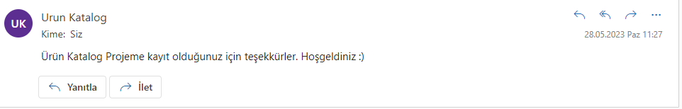
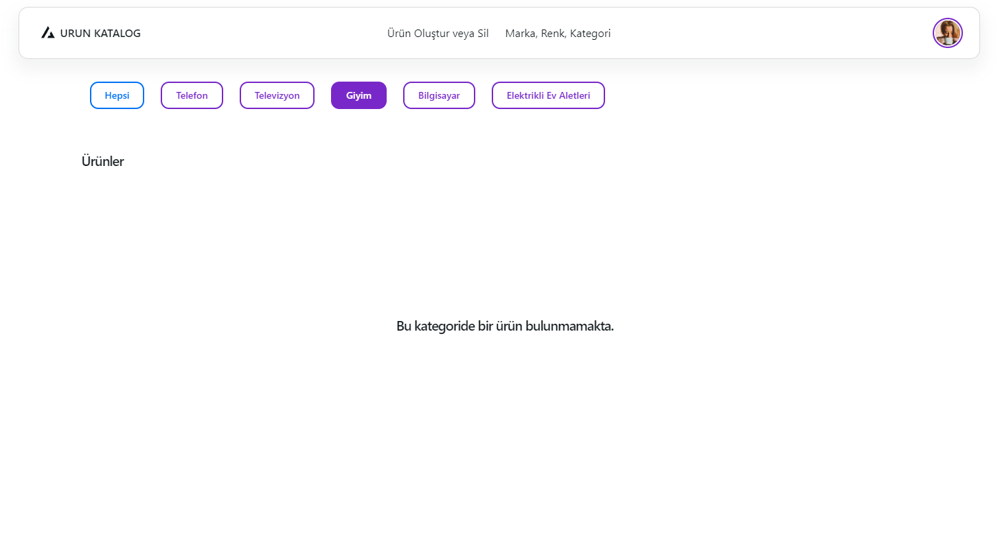

# Ürün Katalog Projesi

Selçuk Üniversitesi Bilgisayar Mühendisliği 4.Sınıf öğrencisi olarak İş Yeri Eğitimim için Primefor Şirketine yaptığım Ürün Katalog Projesi için yaptığım proje.


#### Üye Ol Detayları
• Kullanıcılar sisteme uye olabilmeli. Kayit isleminde alinan bilgiler eksiksiz olmali ve validate 
edilmeli. Email bilgisi gecerli olmali.
• Kayit sirasinda kullanici sifresi sifrelenmis sekilde databasede saklanmali. 
• Ayni sifreye sahip kullanicilarin hashelenmis sifreleri mutlaka farkli olmali. (Tuzlama)
• Sifreler geri cozulemeyecek sekilde sifrelenip saklanmali.
• Email valid olmalı
• En az 8 ve en fazla 20 karakter uzunluğunda bir password girilmeli
• İşlem başarısız ise kullanıcıya tasarıma göre hata mesajı gösterilmeli
• İşlem başarılı ise API'den basarili mesaji gonderilmeli ve Hosgeldiniz Email i gonderilmeli.
#### Üye Girişi Detayları
• Kullanıcılar burden üye girişi yapabilmeli
• Email ve Password alanları zorunlu alanlar olmali. Bos yada gecersiz gonderilirse uyari 
verilmeli.
• Email ve Password alanlarının validasyonu yapılmalı
• Email valid olmalı ve en az 8 ve en fazla 20 karakter uzunluğunda bir password girilmeli
• İşlem başarısız ise kullanıcıya hata mesajı gösterilmeli
• İşlem başarılı ise API'de JWT token uretilmeli ve tüm authantication gerektiren requestlerde 
header'a Bearer token olarak eklenmeli.
• 3 kez parolanin yanlis girilmesi durumunda hesabi bloke ediniz ve kullaniciya bilgilendirme 
maili gonderiniz. 
#### Email Servisi
• Email gonderme islemlerini Sync olarak gonderecek bir tasarim yapmayiniz. 
• Email ler bir kuyruk tablosunda toplanmali ve bir process ordan email gonderimi yapmali. 
• Database,kafka, rabbitmq vs uzerinde kuyruklama islemi yapabilirsiniz. 
• Hangfire gibi servisler kullanarak da yapabilirsiniz.
• Kuyruga gelen her email in en gec 2sn icerisinde process edilmeli. 
• Gonderilen email ler in status durumunu guncelleyiniz. 
• Try count ile basarisiz olmasi durumunda terkar gondermesini saglayiniz. 
• 5 kez deneyip basarisiz olan kayitlari Farkli bir statuye cekerek guncelleyiniz
• Smtp entegrasyonu yaparak mail gonderimini saglayiniz. 
• Smtp hizmetinin calisir sekilde oldugundan emin olunuz. 
#### Kategori Detayları
• Tüm kategoriler listelenmeli
• Kullanıcı kategori id ile api call yaptiginda kategori altindaki ürünler kategoriye göre 
filtrelenmeli, default olarak tüm ürünler çekilmeli.
• Yeni kategori eklenebilmeli veya mevcut olan guncellenebilmeli. 
#### Ürün Detayları
• Teklif Ver apisi üründen gelen data içerisindeki isOfferable alanına gore control edilmeli.
• isOfferable durumunun saglanmadigi takdirde teklif verilememeli. 
• Teklif Ver apisi ile kullanıcı kendisi teklif girebilmeli. Teklif girme alanı number olmalı ve 
buraya validasyon eklenmeli
• ayrica Teklif degeri yuzdelik olarak api tarafına yollanabilmeli (offeredPrice), mesela, 100₺
olan ürün için %40 değeri seçilirse, 40₺ teklif yapılabilmeli
• Eğer bir kullanıcı bir ürüne teklif verdiyse, o ürünün icin teklifini geri cekebilmeli. Verdigi teklif 
yoksa kullanicilar bilgilendirilmeli. 
• Kullanıcı teklif yapmadan bir ürünü direk satın alabilir. Kullanıcı ürünü satın alınca, ilgili ürün 
datası içerisindeki isSold alanının değeri guncellenmeli. 
#### Hesabım Detayları
• Kullanicinin yaptigi offer lar listelenmeli. 
• Kullanicinin urunleri icin aldigi offer lar listelenmeli. 
• Alınan tekliflere Onayla ve Reddet ile cevap verilebilmeli
• Verilen teklif onaylandığında satin alma icin uygun duruma getirilmeli. 
• Ürün detay daki gibi Satın Al tetiklenince statu guncellenmeli. Satın Al'a tetiklenince Teklif 
Verdiklerim listesindeki ürünün durumu güncellenmeli
#### Ürün Ekleme Detayları
• İlgili validasyonlar eklenmeli:
• Ürün Adı alanı maksimum 100 karakter uzunluğunda olmalı ve zorunlu bir alan olmalı
• Açıklama alanı maksimum 500 karakter uzunluğunda olmalı ve zorunlu bir alan olmalı
• Kategori alanı ilgili endpointten çekilen kategorileri listelemeli ve en fazla bir kategori 
seçilebilmeli. Bu alan zorunlu bir alan olmalı
• Renk alanı ilgili endpointten çekilen renkleri listelemeli ve en fazla bir renk seçilebilmeli. Bu 
alan zorunlu bir alan olmamalı
• Marka alanı ilgili endpointten çekilen markaları listelemeli ve en fazla bir marka seçilebilmeli. 
Bu alan zorunlu bir alan olmamalı
• Kullanım Durumu alanı ilgili endpointten çekilen kullanım durumlarını listelemeli ve en fazla 
bir kullanım durumu seçilebilmeli. Bu alan zorunlu bir alan olmalı
• Ürün Görseli alanından en fazla bir ürün görseli eklenmeli. Eklenen ürün görseli istenildiği 
zaman silinebilmeli. Bu alan zorunlu bir alan olmalı. Sadece png/jpg/jpeg formatında 
görseller eklenmeli. Maksimum 400kb değerinde görseller eklenilebilmeli
• Fiyat alanı number olmalı ve zorunlu bir alan olmalı
• Teklif Opsiyonu alanı boolean bir değer olmalı ve default olarak false olmalı


## Kullanılanlar

- .NET 6 Web API
- React
- Microsoft SQL 
- Automapper
- Generic Repository Pattern & Unit of Work
- JWT Token
- Hangfire
- SMTP
- Identity 
- Clean Architecture
## Projeyi Bilgisayarınızda Çalıştırın

### Gerekenler
- Visual Studio 2022
- .Net 6 için gerekli kurulumlar
- Microsoft SQL Server 2019
- React.js için gerekli kurulumlar


#### İlk olarak aşağıdaki komutu kopyalanız. Ardından terminal ekranını açarak, projenin kurulmasını istediğiniz bir alana gelerek yapıştırıp çalıştırınız.

```bash
  git clone https://github.com/snmeric/UrunKatalogAPI.git
```

#### Projeyi build edip gerekli veritabanı işlemlerini yapın.

```bash
  update-database
```

#### Swagger sayfasına ulaşmak için:

```bash
  https://localhost:7104/swagger
```
#### Hangfire sayfasına ulaşmak için:

```bash
  https://localhost:7104/hangfire
```

# React.js
Bu projenin UI tarafında Create React App ve Tailwind CSS ile bazı paketleri kullandım.

## Kullanılan paketler
- @headlessui/react
- @heroicons/react
- @material-tailwind/react
- @nextui-org/react
- formik
- moment
- react-auth-kit
- react-axios
- react-hot-toast
- react-icons
- react-intl-currency-input
- react-select
- yup


#### Projenin dizinine gidin

```bash
  cd urunkatalog_client
```


#### Gerekli paketleri yükleyin

```bash
  npm install
```

#### Sunucuyu çalıştırın

```bash
  npm run start
```
####  Proje tarayıcıda görüntülemek için aşağıdaki adresi açar

  ```bash
  http://localhost:3000
```
## API Kullanımı


#### Kayıt olma

```http
  POST /Authenticate/register
```

| Parametre | Tip     | Açıklama                |
| :-------- | :------- | :------------------------- |
| `username` | `string` | 6 karakterden fazla karakter kullanılması gerekir |
| `email` | `string` | Email |
| `password` | `string` | En az 8, en fazla 20 karakter uzunluğunda şifre |

#### Giriş yapma
```http
  POST /Authenticate/login
```

| Parametre | Tip     | Açıklama                |
| :-------- | :------- | :------------------------- |
| `email` | `string` | Email |
| `password` | `string` | En az 8, en fazla 20 karakter uzunluğunda şifre |

#### Brand (Marka)
Tüm markları getirir.
```http
  GET /api/Brand
```
#### Id'ye göre Brand (Marka) getirme
```http
  GET /api/Brand/{id}
```

| Parametre | Tip     | Açıklama                |
| :-------- | :------- | :------------------------- |
| `id` | `int` | Markanın Id'si gerekir. |


#### Brand (Marka) Oluşturma
```http
  POST /Authenticate/login
```

| Parametre | Tip     | Açıklama                |
| :-------- | :------- | :------------------------- |
| `name` | `string` | Oluşturmak istediğiniz markanın adı. |


#### Kullanıcıya ait teklifleri getirir.

```http
  GET /api/Account/{Username}
```

| Parametre | Tip     | Açıklama                |
| :-------- | :------- | :------------------------- |
| `username` | `string` | Giriş yapan kullanıcı yaptığı teklifleri çeker. |

#### Kullanıcının aldığı teklifleri getirir.

```http
  GET /api/Account
```


#### Gelen Teklifleri kabul etme.

```http
  GET /api/Account/OfferAccept/{id}
```

| Parametre | Tip     | Açıklama                |
| :-------- | :------- | :------------------------- |
| `id` | `int` | Teklifin Id'si gerekir. |
  
#### Gelen Teklifleri reddetme.

```http
  GET /api/Account/OfferReject/{id}
```

| Parametre | Tip     | Açıklama                |
| :-------- | :------- | :------------------------- |
| `id` | `int` | Teklifin Id'si gerekir. |

#### Ürünleri kategorisine göre çağırma

```http
  GET /api/Product/category/{categoryId}
```

| Parametre | Tip     | Açıklama                |
| :-------- | :------- | :------------------------- |
| `categoryId` | `int` | Kategori Id ile o kategoride olan ürünler gelir. |

#### Ürünleri direk satın alma

```http
  GET /api/Product/purchase/{id}
```

| Parametre | Tip     | Açıklama                |
| :-------- | :------- | :------------------------- |
| `id` | `int` | Ürünün id'si ile direk satın alınabilir. |

## Ekran Görüntüleri

#### Swagger


#### Giriş ve Kayıt Ol (Kayıt olduktan sonra hangfire ile eposta atılır. 3'den fazla hata yapması durumunda hesabınız bloke oldu mesajı atılır)




#### Anasayfa (Default olarak hepsini getirir. Seçilen kategoriye göre ise o kategoriye ait ürünler getirilir)




#### Ürün Detay Sayfası (Satın Alma ve Teklif Verme olarak iki yöntem vardır teklif vermede yüzde olarak değer vererek girebilirsiniz. Örneğin 100TL lik ürüne verilen yüzde 40 değeri 40 TL olarak yansır ayrıca direk fiyat teklifi de verebilirsiniz. Satın Al butonu ürünü direk satın almaya yarar.)


#### Teklif Ettiklerim ve Gelen Teklifler (Teklif edilen teklifler geri çekilebilir ayrıca gelen teklifler de silinip onaylananabilir. Ürüne gelen teklif onaylandıktan sonra o ürüne gelen diğer teklifler silinir ve satıldı olarak gösterir)


#### Ürün Oluşturma


#### Ürün Silme


#### Kategori, Marka ve Renk Oluşturma


#### Ürünlerim Sayfası, satın alınan ürünler ve paylaşılan ürünler burda görülür.

